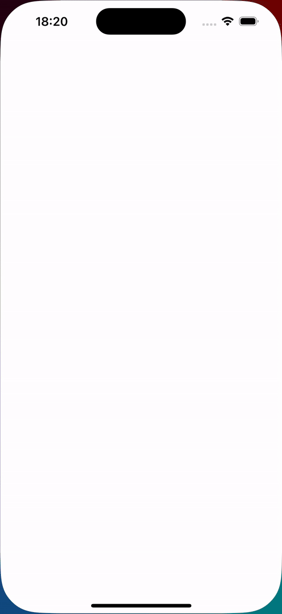

# Kode
Kode is the application that loads the list of employees via API and sorts them by departments.

## Stack
* iOS 13 (UIKit)
* MVVM + Coordinator
* Structured (modern) concurrency
* URLSession + URLCache
* No dependencies

## Features
- Caсhing request for 1 hour
- Custom async image loader with caching to disk and loading indicator 
- Network monitor with connection error popup
  
 

- Shimmer (skeleton) loader
- Custom carousel with empty states
- Searching functionality across all departments
- Filter by ascending/descending order
- Phone call capability
- Error handling including timeout and absence of connection

## Demo

 
 
<em>1.First start with searching and navigating to profile screen.  2.Filter</em>

 

 
 
<em>Network connection error and toast error</em>

 

 
<em>Dark mode</em>

